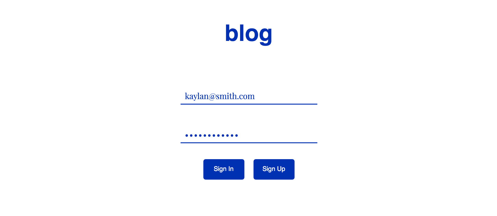

##Blog Platform

Blog platform that allows users to authenticate via email and password, create a post, and view their posts as a list. Users can also view a list of the posts that belong to all users of the app.

When writing a post, the text area dynamically resizes height based on content thanks to [React Textarea Autosize](https://github.com/andreypopp/react-textarea-autosize).

Built with [React](https://facebook.github.io/react/) for views & [Backbone](http://backbonejs.org/) for routing, and [Firebase](https://www.firebase.com/) for data persistance.

Enjoy! 🍕